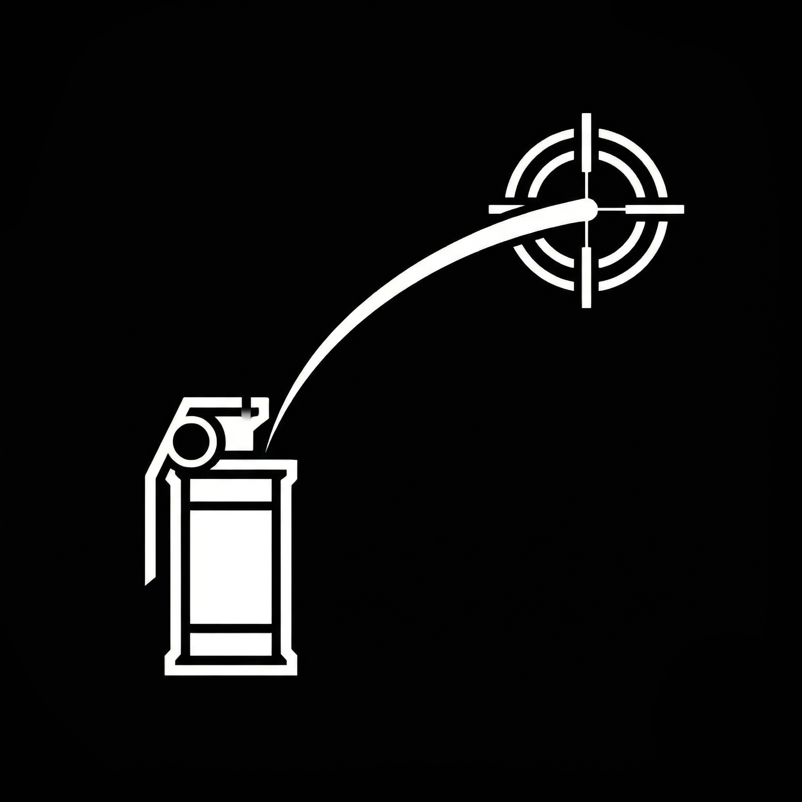

<p align="center">
  
</p>

# Grenade Helper (CS2 道具助手)


**Grenade Helper** 是一款为 **Counter-Strike 2** 玩家设计的道具教学与辅助工具，也可以理解为一个道具便签。
不用在实战中慌乱地找视频，也不用反复跑图练习，把你看到的道具位置记录下来，随时调出直接投掷。

---

## 功能

* **游戏内悬浮窗**：按 `Alt + G`（默认）呼出或隐藏。死亡或开局买枪时可以快速查看点位，不需要 Alt-Tab 切屏。
* **全地图覆盖**：支持 Dust2、Mirage、Inferno 等主流地图池竞技地图。
* **全道具类型**：烟雾弹、燃烧瓶、闪光弹、手雷都支持。
* **多端互通**：
  * PC 端：配合悬浮窗，排位实战中直接查看。
  * 移动端（Android/iOS）：随手打开手机查看道具，不用等待。
* **出生点位**：显示 CT/T 出生点位，帮助你开局更快扔出第一颗道具。
* **点位搜索**：可以在单张地图内搜索道具，也可以在主页搜索所有道具。
* **道具分享/导入**：一键打包分享，或导入他人分享的数据，不用手动添加。
* **道具仓库**：查看 [GitHub 仓库](https://github.com/Invis1ble-2/grenades_repo) 了解更多。
* **爆点查看**：查询道具的爆点位置，或以爆点为基准查看所有相关道具。
* **局域网同步**：同一网络下的设备之间可以直接同步道具数据，不需要联网账号。
* **收藏夹分组**：把常用道具整理进自定义分组，方便查找。
* **区域与标签**：标签系统给道具打上更可观、简单的分类，支持涂绘道具的爆点区域并快速批量给对应的打上区域标签。
* **自动检测更新**：启动时检查新版本，支持多个网盘下载安装包。
* **数据管理**：支持清空/删除自定义地图、批量删除道具、清理孤儿媒体文件、迁移数据目录。
* **内置图片编辑器**：导入道具截图后可以直接裁剪、标注，不用切换到其他软件。
* **节日主题**：应用内置了部分节日限定的界面主题。

---

## 预览


---

## 下载与安装

### Windows
1. 前往 [Releases 页面](../../releases) 下载最新的 `GrenadeHelper_Setup_x.x.x.exe`。
2. 运行安装程序完成安装。
3. 首次运行如果被杀毒软件误报，请添加信任。

### Android
1. 前往 [Releases 页面](../../releases) 下载最新的 `.apk` 安装包。
2. 直接安装即可。

### iOS
1. **AltStore（推荐）**：下载 `.ipa` 文件，用 AltStore 签名安装。
2. **SideStore**：支持免电脑续签。
3. 详细教程见[官网 Wiki](https://grenade-helper.zeabur.app/docs.html#ios-sideload)。

---

## 使用指南

### PC 悬浮窗模式
1. 启动 Grenade Helper。
2. 进入 CS2 游戏（建议设置为**全屏窗口化**或**窗口化**，全屏独占模式下无法显示悬浮窗）。
3. 按快捷键 **`Alt + G`**（可在设置中修改）呼出或隐藏界面。

### 地图与筛选
* 在主页选择正在游玩的地图。
* 顶部标签栏可按道具类型筛选（烟/火/闪/雷）。

---

## 支持项目

如果这个项目对你有帮助，欢迎在爱发电支持我们。

<p align="center">
  
</p>

[](https://afdian.com/a/Invis1ble)

---

## 开发与构建

如果你想在本地开发这个项目，可以按以下步骤构建：

```bash
# Clone 仓库
git clone https://github.com/Invis1ble-2/grenade_helper.git

# 进入目录
cd grenade_helper

# 获取依赖
flutter pub get

# 生成代码 (Isar, JsonSerializable 等)
dart run build_runner build --delete-conflicting-outputs

# 运行 (Windows)
flutter run -d windows
```

---

## 反馈与贡献

* 发现 Bug 请提交 [Issue](../../issues)。
* 欢迎提交 Pull Request 贡献代码。

## 许可证

本项目基于 MIT License 开源。
